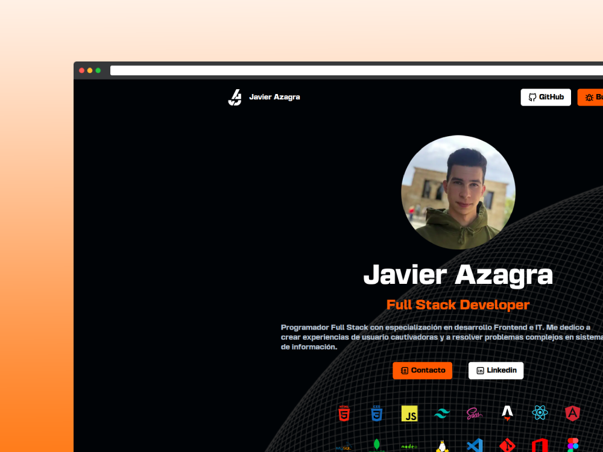

# 🌐 My Portfolio

Este es mi portafolio personal, construido con [Astro](https://astro.build), un framework moderno para construir sitios rápidos y estáticos. El portafolio está diseñado para mostrar mis proyectos, habilidades y experiencia profesional, y está disponible en tres idiomas: **español**, **inglés**, y **alemán**.


<div align="center">
  <a href="https://javierazagra.com" target="_blank">
  
  </a>
</div>

## 🚀 Características

- **Astro**: Framework moderno que genera sitios estáticos ultrarrápidos.
- **i18n (Internacionalización)**: El sitio soporta tres idiomas: español, inglés y alemán. Los usuarios pueden cambiar fácilmente el idioma desde la interfaz del sitio.
- **Diseño Responsive**: Compatible con dispositivos móviles, tablets y pantallas grandes.

## 🌍 Idiomas Disponibles

El portafolio está disponible en los siguientes idiomas:

- **Español** (predeterminado)
- **Inglés**
- **Alemán**

### Cambio de idioma

Los usuarios pueden seleccionar su idioma preferido desde el menú en la parte superior derecha del sitio.

## 📂 Estructura del Proyecto

```
javierazagra.com-astro/
├── public/                   # Archivos estáticos que se sirven directamente
│   ├── favicon.ico           # Icono del sitio
│   └── images/               # Imágenes utilizadas en el sitio
│       ├── hero.jpg          # Imagen de cabecera
│       └── ...               # Otras imágenes
│
├── src/                      # Código fuente del proyecto
│   ├── components/           # Componentes reutilizables
│   │   ├── Footer.astro      # Componente del pie de página
│   │   ├── Header.astro      # Componente de la cabecera
│   │   ├── Layout.astro      # Componente de diseño general
│   │   └── ...               # Otros componentes
│   │
│   ├── layouts/              # Diseños de páginas
│   │   ├── Layout.astro      # Diseño base para todas las páginas
│   │   └── Error404Layout.astro   
│   │
│   ├── pages/                # Páginas del portafolio
│   │   ├── de                # Página principal
│   │   ├── en                # Página "Sobre mí"
│   │   ├── index.astro       # Página de proyectos
│   │   └── ...               # Otras páginas
│   │
│   ├── i18n/                 # Archivos de traducción para i18n
│   │   ├── en.json           # Traducciones al inglés
│   │   ├── es.json           # Traducciones al español
│   │   ├── de.json           # Traducciones al alemán
│   │   ├── index.ts          # Archivo de configuración de i18n
│   │   ├── ui.ts             # Archivo de configuración de i18n
│   │   ├── utils.ts          # Archivo de configuración de i18n
│   │
│   ├── icons/                # Archivos de iconos
│   │   ├── bug.astro         # SVG bug
│   │   └── ...               # Otros iconos
│
├── astro.config.mjs          # Archivo de configuración de Astro
├── package.json              # Dependencias y scripts del proyecto
├── README.md                 # Documentación del proyecto
└── ...                       # Otros archivos de configuración
```

### Instalación

1. Clona el repositorio

   ```sh
   git clone https://github.com/JaviiAzagra/javierazagra.com-astro.git
   cd javierazagra.com-astro
   ```

2. Instala los paquetes de NPM

   ```sh
   pnpm install
   ```

3. Ejecuta el proyecto

   ```sh
   pnpm run dev
   ```

¡Gracias por visitar mi portafolio! Si tienes alguna sugerencia o deseas contribuir, no dudes en hacer un pull request o abrir un issue.
